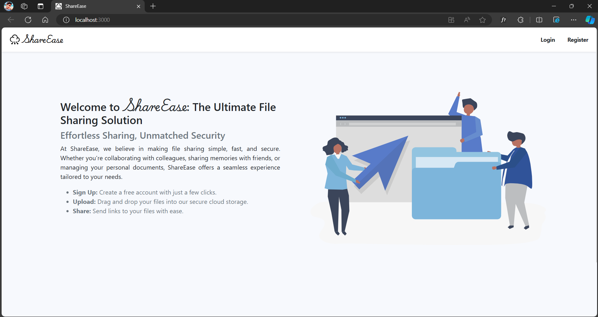
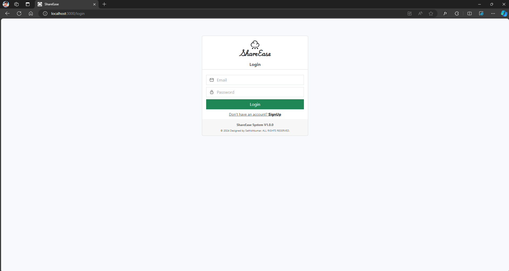
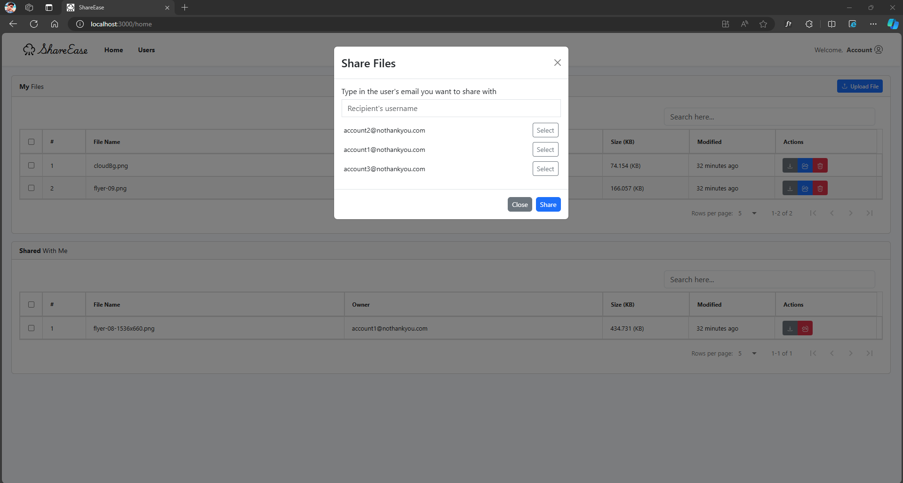

# ShareEase

ShareEase is an intuitive and secure file sharing platform designed to facilitate easy and efficient exchange of files between users. It offers a user-friendly interface for uploading, managing, and sharing files of various types and sizes. Key features include:

- Simple File Upload: Drag-and-drop or select files to upload with ease.
- Secure Sharing: Robust encryption ensures files are shared securely.
- User Management: Control who can access and edit files through customizable permissions.
- Cross-Platform Access: Available on web for convenient access anywhere.

## Technology used

- Backend: **NodeJS**, **Express**
- Database: **MongoDB**
- FrontEnd: **ReactJS**
- Pub-Sub: **Socket.IO**.

## Demo









## Features

- Login, Register, Authentication using JWT Token.
- Database.
- Upload/Share/Unshare/Edit/Remove/Download file with other user - with Authentication
- Pub-sub model on file with real time update.

### What can user do?

1. User can create an account/register an account. To register, the email must not be used by any other user.
2. User can upload/share/delete his file with anyone who is in the system.
3. If user shared with someone, user can remove his file from sharing with that person, or choose not to share with anyone.
4. User can rename the file - **by clicking at the name of the file**.
5. User can see which file is shared with him, he can choose to unshare it if he wants.
6. User have real-time update on the file he subscribes (is shared/owned) to.
7. User can download if the file is shared to him or is owned by him. - Only user who has these privilege can download the file

## How to run

Go to server, install and start the server

```bash
cd server/
npm install && npm start
```

Server should be in `localhost:5000`. Please reserve this port for the application, else you can modify it in `Constants.js`

Go to client, install and start the server

```bash
cd client/
npm install && npm start
```

You can access the website in `localhost:3000` by default

### For testing':'

Please leave both front-back end application on.

Client

```bash
cd client/
npm run test
```

> Your chrome browser’s version has to be 77 and above for the test to run.

Server

```bash
cd server/
npm run test
```

That’s it. Now enjoy the application running.
# shareease
